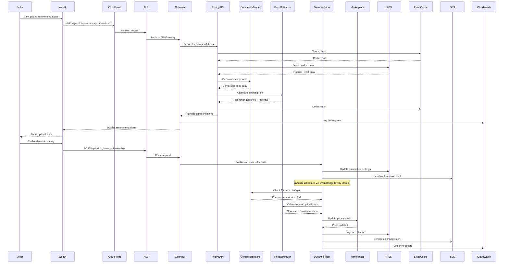

# Design Document: AI-Powered Retail & Marketplace Intelligence Platform

## Overview

The AI-powered Retail & Marketplace Intelligence Platform is a comprehensive decision-support system that combines real-time data analytics, machine learning, and automation to help online marketplace sellers optimize pricing, inventory, and business strategy across multiple platforms (Amazon, Flipkart, Meesho).

The platform architecture follows a cloud-native microservices approach with AWS infrastructure:
- **Frontend**: React 18 + TypeScript with Vite build tool, using Tailwind CSS for styling and Radix UI for accessible components, TanStack Query for data fetching, Recharts for visualizations, React Router v6 for navigation, React Hook Form + Zod for form validation. Hosted on **Amazon S3 + CloudFront** for global CDN delivery
- **Backend API**: Node.js + Express.js + TypeScript for REST API and business logic, JWT for authentication, Swagger/OpenAPI for API documentation. Deployed on **Amazon ECS (Fargate)** for serverless container orchestration
- **AI/ML Services**: Python 3.10+ based microservices using FastAPI framework for demand prediction, competitor intelligence, optimization, health scoring, leakage detection, and trend analysis. Libraries include Scikit-learn, Pandas, NumPy for data processing, Prophet/SARIMA for forecasting, spaCy/NLTK for NLP, OpenAI/Anthropic for LLM integration. Deployed on **Amazon ECS (Fargate)** or **AWS Lambda** for scheduled jobs
- **Data Layer**: **Amazon RDS (PostgreSQL 14+)** for persistent storage with TimescaleDB extension for time-series data, **Amazon ElastiCache (Redis 7+)** for caching and session management, Prisma or TypeORM for database ORM
- **File Storage**: **Amazon S3** for CSV uploads, reports, exports, and backups with lifecycle policies for cost optimization
- **Email Notifications**: **Amazon SES** for stock alerts, price change notifications, surge alerts, and report delivery
- **Secrets Management**: **AWS Secrets Manager** for secure storage of database credentials, API keys, and marketplace credentials
- **Monitoring & Logging**: **Amazon CloudWatch** for application logs, performance metrics, custom dashboards, and alarms
- **Real-time Processing**: **AWS Lambda** for scheduled jobs (surge detection, price tracking) triggered by **Amazon EventBridge**, and event-driven architecture for automated operations
- **Load Balancing**: **Application Load Balancer (ALB)** for distributing traffic across ECS tasks
- **Testing**: Vitest + React Testing Library for frontend, fast-check for property-based testing (TypeScript), Hypothesis for property-based testing (Python), Playwright/Cypress for E2E testing
- **DevOps**: Docker for containerization, **Amazon ECR** for container registry, **AWS CodePipeline** (optional) for CI/CD, Winston for structured logging integrated with CloudWatch

The system is designed for scalability, extensibility, and real-time responsiveness while maintaining data security and user privacy through AWS security best practices.

## Architecture

### High-Level AWS Architecture

```mermaid
graph TB
    subgraph "Client Layer"
        WebUI[Web UI - React 18/TypeScript/Vite]
        Mobile[Mobile-Responsive Interface]
    end
    
    subgraph "AWS CloudFront CDN"
        CloudFront[CloudFront Distribution]
        S3Static[S3 Static Website Hosting]
    end
    
    subgraph "AWS Load Balancing"
        ALB[Application Load Balancer]
    end
    
    subgraph "AWS ECS Fargate - Application Services"
        Gateway[Express.js API Gateway + TypeScript]
        Auth[JWT Authentication & Session Management]
        DataAPI[Data API Service]
        AnalyticsAPI[Analytics API Service]
        PricingAPI[Pricing API Service]
        InventoryAPI[Inventory API Service]
        CopilotAPI[AI Copilot API Service]
        HealthAPI[Health Score API Service]
        AlertsAPI[Alerts API Service]
    end
    
    subgraph "AWS ECS Fargate - AI/ML Services (Python/FastAPI)"
        DemandPredictor[Demand Prediction Engine]
        CompetitorTracker[Competitor Intelligence Service]
        PriceOptimizer[Price Optimization Engine]
        InventoryOptimizer[Inventory Optimization Engine]
        DynamicPricer[Dynamic Pricing Automation]
        IntelligenceEngine[Cross-Marketplace Intelligence]
        CopilotEngine[AI Business Copilot - LLM]
        HealthScoreEngine[Business Health Score Engine]
        LeakageDetector[Profit Leakage Detector]
        TrendAnalyzer[Trend Opportunities Analyzer]
        AlertManager[Smart Alert Manager]
    end
    
    subgraph "AWS Lambda Functions"
        SurgeDetector[Surge Detector Lambda]
        PriceTracker[Price Tracker Lambda]
        DataSync[Data Sync Lambda]
    end
    
    subgraph "AWS Data Layer"
        RDS[(Amazon RDS PostgreSQL 14+ + TimescaleDB)]
        ElastiCache[Amazon ElastiCache Redis 7+]
        S3Storage[Amazon S3 - Files & Backups]
    end
    
    subgraph "AWS Security & Monitoring"
        SecretsManager[AWS Secrets Manager]
        CloudWatch[Amazon CloudWatch]
        IAM[AWS IAM Roles]
    end
    
    subgraph "AWS Communication"
        SES[Amazon SES - Email]
        EventBridge[Amazon EventBridge]
    end
    
    subgraph "External Integrations"
        Amazon[Amazon Marketplace API]
        Flipkart[Flipkart Marketplace API]
        Meesho[Meesho Marketplace API]
        LLM[LLM API - OpenAI/Anthropic]
    end
    
    WebUI --> CloudFront
    Mobile --> CloudFront
    CloudFront --> S3Static
    CloudFront --> ALB
    
    ALB --> Gateway
    Gateway --> Auth
    Gateway --> DataAPI
    Gateway --> AnalyticsAPI
    Gateway --> PricingAPI
    Gateway --> InventoryAPI
    Gateway --> CopilotAPI
    Gateway --> HealthAPI
    Gateway --> AlertsAPI
    
    Auth --> ElastiCache
    DataAPI --> RDS
    DataAPI --> ElastiCache
    DataAPI --> S3Storage
    
    AnalyticsAPI --> DemandPredictor
    AnalyticsAPI --> IntelligenceEngine
    AnalyticsAPI --> TrendAnalyzer
    
    PricingAPI --> CompetitorTracker
    PricingAPI --> PriceOptimizer
    PricingAPI --> DynamicPricer
    
    InventoryAPI --> InventoryOptimizer
    
    CopilotAPI --> CopilotEngine
    CopilotEngine --> LLM
    
    HealthAPI --> HealthScoreEngine
    HealthAPI --> LeakageDetector
    
    AlertsAPI --> AlertManager
    
    DemandPredictor --> RDS
    CompetitorTracker --> RDS
    PriceOptimizer --> RDS
    InventoryOptimizer --> RDS
    DynamicPricer --> RDS
    IntelligenceEngine --> RDS
    HealthScoreEngine --> RDS
    HealthScoreEngine --> ElastiCache
    LeakageDetector --> RDS
    TrendAnalyzer --> RDS
    AlertManager --> RDS
    AlertManager --> ElastiCache
    
    EventBridge --> SurgeDetector
    EventBridge --> PriceTracker
    EventBridge --> DataSync
    
    SurgeDetector --> RDS
    PriceTracker --> RDS
    DataSync --> RDS
    
    CompetitorTracker --> Amazon
    CompetitorTracker --> Flipkart
    CompetitorTracker --> Meesho
    
    DynamicPricer --> Amazon
    DynamicPricer --> Flipkart
    DynamicPricer --> Meesho
    
    DataAPI --> Amazon
    DataAPI --> Flipkart
    DataAPI --> Meesho
    
    AlertManager --> SES
    HealthScoreEngine --> SES
    InventoryOptimizer --> SES
    
    Gateway --> SecretsManager
    DataAPI --> SecretsManager
    
    Gateway --> CloudWatch
    DataAPI --> CloudWatch
    AnalyticsAPI --> CloudWatch
    PricingAPI --> CloudWatch
    
    Gateway --> IAM
    DataAPI --> IAM
    S3Storage --> IAM
```



### Component Interaction Flow



## AWS Infrastructure Components

### 1. Compute Services

#### Amazon ECS (Fargate)
- **Purpose**: Serverless container orchestration for Node.js backend and Python AI/ML services
- **Configuration**:
  - Task Definition: 0.5 vCPU, 1GB memory per task (adjustable)
  - Auto Scaling: Scale based on CPU/memory utilization and request count
  - Service Discovery: AWS Cloud Map for inter-service communication
  - Health Checks: ALB health checks with 30-second intervals
- **Deployment**: Blue/green deployment strategy for zero-downtime updates

#### AWS Lambda
- **Purpose**: Serverless functions for scheduled background jobs
- **Functions**:
  - **Surge Detector**: Runs hourly via EventBridge, analyzes sales trends
  - **Price Tracker**: Runs every 30 minutes, monitors competitor prices
  - **Data Sync**: Triggered by EventBridge, syncs marketplace data
- **Configuration**:
  - Runtime: Node.js 20.x or Python 3.10
  - Memory: 512MB - 1024MB
  - Timeout: 5 minutes (300 seconds)
  - Concurrency: Reserved concurrency for critical functions

### 2. Database & Storage

#### Amazon RDS (PostgreSQL 14+)
- **Purpose**: Primary relational database for all application data
- **Configuration**:
  - Instance Class: db.t3.micro (dev), db.t3.small (prod)
  - Multi-AZ: Enabled for high availability
  - Storage: 20GB SSD with auto-scaling up to 100GB
  - Backups: Automated daily backups with 7-day retention
  - Encryption: At-rest encryption enabled
  - Extensions: TimescaleDB for time-series data
- **Performance**: Connection pooling via RDS Proxy

#### Amazon ElastiCache (Redis 7+)
- **Purpose**: In-memory caching and session management
- **Configuration**:
  - Node Type: cache.t3.micro (dev), cache.t3.small (prod)
  - Cluster Mode: Disabled for simplicity, enabled for production scaling
  - Encryption: In-transit and at-rest encryption enabled
  - Automatic Failover: Enabled with Multi-AZ
- **Use Cases**:
  - API response caching (TTL: 5-30 minutes)
  - Session storage (TTL: 24 hours)
  - Product data caching (TTL: 1 hour)
  - Competitor price caching (TTL: 2 hours)
  - Analytics caching (TTL: 30 minutes)

#### Amazon S3
- **Purpose**: Object storage for files, reports, and backups
- **Buckets**:
  - `marketplace-copilot-storage`: Main storage bucket
  - `marketplace-copilot-static`: Static website hosting for React frontend
- **Folder Structure**:
  - `/uploads/`: CSV file uploads from users
  - `/reports/`: Generated PDF/CSV reports
  - `/backups/`: Database backups and exports
  - `/exports/`: Analytics data exports
- **Lifecycle Policies**:
  - Move to S3 Intelligent-Tiering after 30 days
  - Move to Glacier after 90 days for backups
  - Delete old uploads after 180 days
- **Security**: Bucket encryption, versioning enabled, public access blocked

### 3. Networking & Load Balancing

#### Application Load Balancer (ALB)
- **Purpose**: Distribute traffic across ECS tasks
- **Configuration**:
  - Scheme: Internet-facing
  - Listeners: HTTPS (443) with SSL/TLS certificate
  - Target Groups: ECS services with health checks
  - Sticky Sessions: Enabled for session management
  - Connection Draining: 300 seconds
- **Security**: WAF rules for DDoS protection and rate limiting

#### Amazon CloudFront
- **Purpose**: Global CDN for static assets and API caching
- **Configuration**:
  - Origin: S3 bucket for static files, ALB for API
  - Cache Behavior: Cache static assets, pass-through for API
  - SSL/TLS: Custom domain with ACM certificate
  - Geo-Restriction: Optional based on business requirements
- **Performance**: Edge locations for low-latency global access

### 4. Security & Secrets Management

#### AWS Secrets Manager
- **Purpose**: Secure storage of sensitive credentials
- **Secrets Stored**:
  - Database credentials (RDS connection string)
  - API keys (GROQ, OpenAI, Anthropic)
  - Marketplace API credentials (Amazon, Flipkart, Meesho)
  - JWT signing keys
  - Redis authentication tokens
- **Rotation**: Automatic rotation enabled for database credentials
- **Access**: IAM role-based access from ECS tasks and Lambda functions

#### AWS IAM
- **Purpose**: Identity and access management
- **Roles**:
  - `marketplace-ecs-task-role`: For ECS tasks to access RDS, S3, SES, Secrets Manager
  - `marketplace-lambda-role`: For Lambda functions to access RDS, CloudWatch
  - `marketplace-codepipeline-role`: For CI/CD pipeline (optional)
- **Policies**: Least privilege principle, specific resource ARNs

### 5. Monitoring & Logging

#### Amazon CloudWatch
- **Purpose**: Centralized logging, monitoring, and alerting
- **Log Groups**:
  - `/aws/ecs/marketplace-backend`: Backend API logs
  - `/aws/ecs/marketplace-ai-services`: AI/ML service logs
  - `/aws/lambda/surge-detector`: Surge detector Lambda logs
  - `/aws/lambda/price-tracker`: Price tracker Lambda logs
- **Metrics**:
  - Custom metrics: API response times, cache hit rates, pricing decisions
  - ECS metrics: CPU, memory, task count
  - RDS metrics: Connections, query performance, storage
  - Lambda metrics: Invocations, duration, errors
- **Alarms**:
  - High error rate (>5% of requests)
  - High CPU/memory utilization (>80%)
  - Database connection pool exhaustion
  - Lambda function failures
  - S3 upload failures
- **Dashboards**: Custom dashboards for business metrics and system health

### 6. Communication Services

#### Amazon SES
- **Purpose**: Transactional email delivery
- **Email Types**:
  - Stock alerts (low inventory warnings)
  - Price change notifications
  - Surge opportunity alerts
  - Business health score updates
  - Report delivery (PDF/CSV attachments)
  - Welcome emails for new users
- **Configuration**:
  - Verified domain: marketplace-copilot.com
  - DKIM and SPF records configured
  - Bounce and complaint handling
  - Production access approved
- **Templates**: HTML email templates with branding

#### Amazon EventBridge
- **Purpose**: Event-driven architecture and scheduled jobs
- **Rules**:
  - `surge-detector-schedule`: Trigger surge detector Lambda hourly
  - `price-tracker-schedule`: Trigger price tracker Lambda every 30 minutes
  - `data-sync-schedule`: Trigger data sync Lambda every 6 hours
  - `health-score-calculation`: Trigger health score calculation daily
- **Event Patterns**: Custom events for real-time processing

### 7. Deployment & CI/CD

#### Amazon ECR
- **Purpose**: Container registry for Docker images
- **Repositories**:
  - `marketplace-backend`: Node.js backend image
  - `marketplace-ai-services`: Python AI/ML services image
- **Lifecycle Policies**: Keep last 10 images, delete untagged images after 7 days

#### AWS CodePipeline (Optional)
- **Purpose**: Automated CI/CD pipeline
- **Stages**:
  1. Source: GitHub repository
  2. Build: CodeBuild for Docker image creation
  3. Test: Run unit and integration tests
  4. Deploy: Update ECS services with new images
- **Rollback**: Automatic rollback on deployment failures

## AWS Cost Optimization

### Development Environment (~$42/month)
- RDS db.t3.micro: $15/month
- ElastiCache cache.t3.micro: $12/month
- ECS Fargate (1 task, 0.5 vCPU, 1GB): $15/month
- S3 (10GB): $0.23/month
- Lambda (100K invocations): $0.02/month
- CloudWatch Logs (1GB): $0.50/month
- SES (1K emails): $0.10/month

### Production Environment (~$142/month)
- RDS db.t3.small Multi-AZ: $60/month
- ElastiCache cache.t3.small: $48/month
- ECS Fargate (2 tasks): $30/month
- S3 (50GB): $1.15/month
- Lambda (1M invocations): $0.20/month
- CloudWatch Logs (5GB): $2.50/month
- SES (10K emails): $1/month
- Data Transfer: $10/month

### Cost Optimization Strategies
1. Use AWS Free Tier for first 12 months
2. Reserved Instances for RDS and ElastiCache (save 30-40%)
3. S3 Intelligent-Tiering for automatic cost optimization
4. Lambda for scheduled jobs instead of always-on containers
5. CloudFront caching to reduce origin requests
6. ECS Fargate Spot for non-critical workloads (save 70%)
7. Right-sizing: Monitor and adjust instance sizes based on usage

## AWS Security Best Practices

1. **Encryption**: All data encrypted at rest (S3, RDS, EBS) and in transit (TLS 1.3)
2. **Network Isolation**: VPC with private subnets for RDS and ElastiCache
3. **Security Groups**: Restrictive inbound/outbound rules
4. **IAM**: Least privilege access, no root account usage
5. **Secrets**: All credentials in Secrets Manager, no hardcoded secrets
6. **Monitoring**: CloudTrail for audit logs, GuardDuty for threat detection
7. **Backups**: Automated backups for RDS, S3 versioning enabled
8. **Compliance**: GDPR-compliant data handling, encryption standards

## Disaster Recovery

### Backup Strategy
- **RDS**: Automated daily backups, 7-day retention, point-in-time recovery
- **S3**: Versioning enabled, cross-region replication for critical data
- **Configuration**: Infrastructure as Code (Terraform/CloudFormation) in version control

### Recovery Objectives
- **RTO (Recovery Time Objective)**: 4 hours
- **RPO (Recovery Point Objective)**: 1 hour (RDS automated backups)

### Failover Procedures
1. RDS Multi-AZ automatic failover (<2 minutes)
2. ECS task auto-restart on failure
3. Lambda automatic retry with exponential backoff
4. Manual failover to backup region if needed

## Components and Interfaces

### 1. Frontend Components

#### 1.1 Dashboard Component
**Purpose**: Main interface for viewing key metrics and insights

**Interface**:
```typescript
interface DashboardProps {
  sellerId: string;
  dateRange: DateRange;
}

interface DashboardMetrics {
  totalRevenue: number;
  totalOrders: number;
  averageMargin: number;
  inventoryValue: number;
  topProducts: ProductMetric[];
  revenueByMarketplace: MarketplaceRevenue[];
  alerts: Alert[];
}
```

#### 1.2 Pricing Intelligence Component
**Purpose**: Display competitor pricing and recommendations

**Interface**:
```typescript
interface PricingIntelligenceProps {
  sku: string;
  sellerId: string;
}

interface PricingData {
  currentPrice: number;
  recommendedPrice: number;
  competitorPrices: CompetitorPrice[];
  priceHistory: PricePoint[];
  optimization: PriceOptimization;
}

interface CompetitorPrice {
  competitorId: string;
  competitorName: string;
  price: number;
  marketplace: string;
  lastUpdated: Date;
  availability: boolean;
}

interface PriceOptimization {
  recommendedPrice: number;
  expectedMargin: number;
  expectedVolume: number;
  rationale: string;
  confidence: number;
}
```

#### 1.3 Inventory Management Component
**Purpose**: Display inventory status and recommendations

**Interface**:
```typescript
interface InventoryManagementProps {
  sellerId: string;
  filters: InventoryFilters;
}

interface InventoryItem {
  sku: string;
  productName: string;
  currentStock: number;
  reorderPoint: number;
  recommendedOrderQuantity: number;
  stockAllocation: StockAllocation[];
  daysOfStock: number;
  status: 'healthy' | 'low' | 'critical' | 'overstock';
}

interface StockAllocation {
  marketplace: string;
  allocatedQuantity: number;
  recommendedQuantity: number;
}
```

#### 1.4 AI Copilot Component
**Purpose**: Conversational interface for business insights

**Interface**:
```typescript
interface CopilotProps {
  sellerId: string;
}

interface CopilotMessage {
  id: string;
  role: 'user' | 'assistant';
  content: string;
  timestamp: Date;
  visualizations?: Visualization[];
  actions?: RecommendedAction[];
}

interface Visualization {
  type: 'chart' | 'table' | 'metric';
  data: any;
  config: VisualizationConfig;
}

interface RecommendedAction {
  id: string;
  title: string;
  description: string;
  impact: 'high' | 'medium' | 'low';
  actionType: 'pricing' | 'inventory' | 'marketplace';
  executable: boolean;
}
```

#### 1.5 Business Health Dashboard Component
**Purpose**: Display comprehensive business health score and breakdown

**Tech Stack**: React 18, TypeScript, Recharts for score visualizations, Radix UI for progress indicators

**Interface**:
```typescript
interface HealthDashboardProps {
  sellerId: string;
  timeRange: DateRange;
}

interface BusinessHealthScore {
  overallScore: number; // 0-100
  trend: 'improving' | 'stable' | 'declining';
  components: HealthComponent[];
  historicalScores: HistoricalScore[];
  recommendations: HealthRecommendation[];
  lastUpdated: Date;
}

interface HealthComponent {
  name: 'profitability' | 'inventory' | 'pricing' | 'sales_velocity';
  score: number; // 0-100
  weight: number; // contribution to overall score
  status: 'critical' | 'warning' | 'good' | 'excellent';
  trend: 'up' | 'down' | 'stable';
  details: ComponentDetails;
}

interface HealthRecommendation {
  id: string;
  component: string;
  priority: 'critical' | 'high' | 'medium' | 'low';
  title: string;
  description: string;
  expectedImpact: number; // score improvement
  actionable: boolean;
}
```

#### 1.6 Profit Leakage Panel Component
**Purpose**: Visualize profit leakage sources and recovery opportunities

**Tech Stack**: React 18, TypeScript, Recharts for waterfall charts, TanStack Query for data fetching

**Interface**:
```typescript
interface LeakagePanelProps {
  sellerId: string;
  timeRange: DateRange;
}

interface ProfitLeakageAnalysis {
  totalLeakage: number;
  potentialRecovery: number;
  leakageSources: LeakageSource[];
  topLeakingProducts: ProductLeakage[];
  trends: LeakageTrend[];
}

interface LeakageSource {
  source: 'fees' | 'pricing' | 'inventory' | 'shipping';
  amount: number;
  percentage: number;
  priority: number;
  description: string;
  recommendations: string[];
  recoveryPotential: number;
}

interface ProductLeakage {
  sku: string;
  productName: string;
  totalLeakage: number;
  leakageBreakdown: LeakageSource[];
  optimizationOpportunity: number;
}
```

#### 1.7 Smart Alerts Panel Component
**Purpose**: Display prioritized, actionable alerts with one-click actions

**Tech Stack**: React 18, TypeScript, Radix UI for alert cards and modals, React Hook Form for alert preferences

**Interface**:
```typescript
interface AlertsPanelProps {
  sellerId: string;
}

interface SmartAlert {
  id: string;
  priority: 'critical' | 'high' | 'medium' | 'low';
  category: 'pricing' | 'inventory' | 'sales' | 'competition' | 'health';
  title: string;
  description: string;
  impact: AlertImpact;
  timestamp: Date;
  actions: QuickAction[];
  relatedAlerts?: string[]; // IDs of grouped alerts
  dismissible: boolean;
}

interface AlertImpact {
  metric: string;
  currentValue: number;
  projectedValue: number;
  monetaryImpact?: number;
  urgency: 'immediate' | 'today' | 'this_week' | 'this_month';
}

interface QuickAction {
  id: string;
  label: string;
  actionType: 'accept_recommendation' | 'view_details' | 'snooze' | 'dismiss';
  requiresConfirmation: boolean;
  payload?: any;
}

interface AlertPreferences {
  enabledCategories: string[];
  priorityThreshold: 'critical' | 'high' | 'medium' | 'low';
  notificationChannels: NotificationChannel[];
  quietHours?: TimeRange;
}
```

#### 1.8 Trend Opportunities Component
**Purpose**: Display emerging trends and market opportunities

**Tech Stack**: React 18, TypeScript, Recharts for trend visualizations, TanStack Query for real-time updates

**Interface**:
```typescript
interface TrendOpportunitiesProps {
  sellerId: string;
}

interface TrendOpportunity {
  id: string;
  trendType: 'emerging_category' | 'seasonal' | 'niche' | 'cross_sell';
  title: string;
  description: string;
  confidence: number; // 0-100
  lifecycle: 'emerging' | 'growing' | 'peaking' | 'declining';
  metrics: TrendMetrics;
  recommendations: TrendRecommendation[];
  competitiveAnalysis: CompetitiveAnalysis;
  historicalData: TrendDataPoint[];
}

interface TrendMetrics {
  demandGrowth: number; // percentage
  marketSize: number;
  competitionLevel: 'low' | 'medium' | 'high';
  estimatedRevenue: number;
  estimatedProfit: number;
  timeToMarket: number; // days
}

interface TrendRecommendation {
  type: 'add_product' | 'optimize_existing' | 'bundle' | 'marketplace_expansion';
  title: string;
  description: string;
  products?: string[]; // SKUs
  expectedImpact: number;
  priority: 'high' | 'medium' | 'low';
}

interface CompetitiveAnalysis {
  competitorCount: number;
  averagePrice: number;
  priceRange: { min: number; max: number };
  marketShare: MarketShareData[];
}
```

### 2. Backend API Services

#### 2.1 Data API Service
**Purpose**: Unified interface for marketplace data ingestion and querying

**Endpoints**:
```typescript
// Marketplace data sync
POST /api/data/sync/amazon
POST /api/data/sync/flipkart
POST /api/data/sync/meesho

// Query unified data
GET /api/data/products?sellerId={id}&marketplace={name}
GET /api/data/sales?sellerId={id}&dateRange={range}
GET /api/data/inventory?sellerId={id}

// Data validation and conflicts
GET /api/data/conflicts?sellerId={id}
POST /api/data/conflicts/resolve
```

**Data Models**:
```typescript
interface UnifiedProduct {
  sku: string;
  sellerId: string;
  productName: string;
  category: string;
  costPrice: number;
  marketplaceData: MarketplaceProductData[];
  createdAt: Date;
  updatedAt: Date;
}

interface MarketplaceProductData {
  marketplace: string;
  marketplaceProductId: string;
  listingPrice: number;
  stock: number;
  status: 'active' | 'inactive' | 'out_of_stock';
  lastSynced: Date;
}

interface UnifiedSale {
  saleId: string;
  sku: string;
  sellerId: string;
  marketplace: string;
  quantity: number;
  salePrice: number;
  fees: number;
  netRevenue: number;
  saleDate: Date;
}
```

#### 2.2 Analytics API Service
**Purpose**: Provide demand forecasting and trend analysis

**Endpoints**:
```typescript
GET /api/analytics/demand/forecast?sku={sku}&horizon={days}
GET /api/analytics/trends?sellerId={id}&category={cat}
GET /api/analytics/insights?sellerId={id}
```

**Response Models**:
```typescript
interface DemandForecast {
  sku: string;
  forecasts: ForecastPoint[];
  confidence: number;
  trends: TrendAnalysis;
  recommendations: string[];
}

interface ForecastPoint {
  date: Date;
  predictedDemand: number;
  lowerBound: number;
  upperBound: number;
}

interface TrendAnalysis {
  trendType: 'growing' | 'declining' | 'stable' | 'seasonal';
  growthRate: number;
  seasonalityDetected: boolean;
  seasonalPattern?: SeasonalPattern;
}
```

#### 2.3 Pricing API Service
**Purpose**: Competitor tracking and price optimization

**Endpoints**:
```typescript
GET /api/pricing/competitors/:sku
GET /api/pricing/intelligence/:sku
POST /api/pricing/optimize
GET /api/pricing/recommendations/:sku
POST /api/pricing/automation/enable
POST /api/pricing/automation/disable
GET /api/pricing/history/:sku
```

**Response Models**:
```typescript
interface PriceIntelligence {
  sku: string;
  currentPrice: number;
  competitorStats: CompetitorStats;
  pricePosition: 'lowest' | 'competitive' | 'premium' | 'highest';
  recommendations: PriceRecommendation[];
}

interface CompetitorStats {
  competitorCount: number;
  minPrice: number;
  maxPrice: number;
  avgPrice: number;
  medianPrice: number;
  priceDistribution: PriceDistribution[];
}

interface PriceRecommendation {
  strategy: string;
  recommendedPrice: number;
  expectedMargin: number;
  expectedVolume: number;
  expectedRevenue: number;
  rationale: string;
}
```

#### 2.4 Inventory API Service
**Purpose**: Smart inventory management and recommendations

**Endpoints**:
```typescript
GET /api/inventory/status?sellerId={id}
GET /api/inventory/recommendations/:sku
GET /api/inventory/alerts?sellerId={id}
POST /api/inventory/allocation/optimize
```

**Response Models**:
```typescript
interface InventoryRecommendation {
  sku: string;
  currentStock: number;
  reorderPoint: number;
  recommendedOrderQuantity: number;
  urgency: 'critical' | 'high' | 'medium' | 'low';
  daysUntilStockout: number;
  allocationStrategy: AllocationStrategy[];
  rationale: string;
}

interface AllocationStrategy {
  marketplace: string;
  currentAllocation: number;
  recommendedAllocation: number;
  expectedSalesRate: number;
  reason: string;
}
```

#### 2.5 AI Copilot API Service
**Purpose**: Conversational business intelligence

**Tech Stack**: Node.js, Express.js, TypeScript, JWT auth, integration with Python FastAPI LLM service

**Endpoints**:
```typescript
POST /api/copilot/chat
GET /api/copilot/history?sellerId={id}
POST /api/copilot/execute-action
```

**Request/Response Models**:
```typescript
interface CopilotRequest {
  sellerId: string;
  message: string;
  context?: ConversationContext;
}

interface CopilotResponse {
  messageId: string;
  response: string;
  visualizations: Visualization[];
  recommendedActions: RecommendedAction[];
  confidence: number;
  sources: DataSource[];
}

interface ConversationContext {
  previousMessages: string[];
  currentFocus: 'pricing' | 'inventory' | 'sales' | 'general';
  relevantSkus: string[];
}
```

#### 2.6 Health Score API Service
**Purpose**: Business health monitoring and scoring

**Tech Stack**: Node.js, Express.js, TypeScript, integration with Python FastAPI health scoring engine

**Endpoints**:
```typescript
GET /api/health/score?sellerId={id}
GET /api/health/components?sellerId={id}
GET /api/health/history?sellerId={id}&timeRange={range}
GET /api/health/recommendations?sellerId={id}
POST /api/health/recalculate
```

**Response Models**:
```typescript
interface HealthScoreResponse {
  sellerId: string;
  overallScore: number;
  components: ComponentScore[];
  trend: TrendIndicator;
  recommendations: HealthRecommendation[];
  lastCalculated: Date;
}

interface ComponentScore {
  component: string;
  score: number;
  weight: number;
  status: 'critical' | 'warning' | 'good' | 'excellent';
  metrics: ComponentMetrics;
}
```

#### 2.7 Leakage Detection API Service
**Purpose**: Profit leakage identification and quantification

**Tech Stack**: Node.js, Express.js, TypeScript, integration with Python FastAPI leakage detection engine

**Endpoints**:
```typescript
GET /api/leakage/analysis?sellerId={id}&timeRange={range}
GET /api/leakage/sources?sellerId={id}
GET /api/leakage/products?sellerId={id}&sortBy=leakage
GET /api/leakage/recovery-potential?sellerId={id}
POST /api/leakage/track-improvement
```

**Response Models**:
```typescript
interface LeakageAnalysisResponse {
  totalLeakage: number;
  potentialRecovery: number;
  leakageSources: LeakageSource[];
  topLeakingProducts: ProductLeakage[];
  trends: LeakageTrend[];
  recommendations: LeakageRecommendation[];
}

interface LeakageRecommendation {
  source: string;
  action: string;
  expectedRecovery: number;
  effort: 'low' | 'medium' | 'high';
  priority: number;
}
```

#### 2.8 Alerts API Service
**Purpose**: Intelligent alert management and delivery

**Tech Stack**: Node.js, Express.js, TypeScript, Redis for alert queuing, WebSocket for real-time delivery

**Endpoints**:
```typescript
GET /api/alerts?sellerId={id}&priority={level}
GET /api/alerts/:alertId
POST /api/alerts/:alertId/action
POST /api/alerts/:alertId/dismiss
POST /api/alerts/:alertId/snooze
GET /api/alerts/preferences?sellerId={id}
PUT /api/alerts/preferences
GET /api/alerts/history?sellerId={id}
```

**Response Models**:
```typescript
interface AlertsResponse {
  alerts: SmartAlert[];
  totalCount: number;
  unreadCount: number;
  criticalCount: number;
  groupedAlerts: GroupedAlert[];
}

interface GroupedAlert {
  groupId: string;
  category: string;
  alertCount: number;
  highestPriority: string;
  summary: string;
  alerts: SmartAlert[];
}
```

#### 2.9 Trends API Service
**Purpose**: Trend opportunity identification and analysis

**Tech Stack**: Node.js, Express.js, TypeScript, integration with Python FastAPI trend analysis engine

**Endpoints**:
```typescript
GET /api/trends/opportunities?sellerId={id}
GET /api/trends/:trendId
GET /api/trends/categories?marketplace={name}
GET /api/trends/seasonal?timeframe={months}
GET /api/trends/recommendations?sellerId={id}&trendId={id}
POST /api/trends/track
```

**Response Models**:
```typescript
interface TrendOpportunitiesResponse {
  opportunities: TrendOpportunity[];
  totalCount: number;
  categories: CategoryTrend[];
  seasonalTrends: SeasonalTrend[];
}

interface CategoryTrend {
  category: string;
  growthRate: number;
  marketSize: number;
  competitionLevel: string;
  relevanceScore: number;
}
```

### 3. AI/ML Services (Python)

#### 3.1 Demand Prediction Engine
**Purpose**: Forecast product demand using time-series analysis

**Algorithm**: 
- SARIMA (Seasonal AutoRegressive Integrated Moving Average) for time-series forecasting
- Prophet for handling seasonality and holidays
- Ensemble approach combining multiple models

**Interface**:
```python
class DemandPredictor:
    def train_model(self, sku: str, historical_data: pd.DataFrame) -> Model
    def predict(self, sku: str, horizon_days: int) -> ForecastResult
    def detect_trends(self, sku: str) -> TrendAnalysis
    def calculate_confidence(self, predictions: np.array, actual: np.array) -> float
```

**Input Data**:
- Historical sales data (date, quantity, price)
- External factors (holidays, promotions, seasonality)
- Competitor activity

**Output**:
- Daily demand forecasts with confidence intervals
- Trend classification (growing/declining/stable/seasonal)
- Seasonality patterns
- Anomaly detection

#### 3.2 Competitor Intelligence Service
**Purpose**: Discover and track competitor products and pricing

**Components**:
- **Discovery Module**: Uses product matching algorithms (TF-IDF, cosine similarity) to find competitors
- **Tracking Module**: Scheduled scraping and API calls to monitor prices
- **Analysis Module**: Identifies pricing patterns and strategies

**Interface**:
```python
class CompetitorTracker:
    def discover_competitors(self, sku: str, product_name: str, marketplace: str) -> List[Competitor]
    def track_prices(self, sku: str) -> List[PriceUpdate]
    def analyze_pricing_strategy(self, competitor_id: str) -> PricingStrategy
    def detect_price_movements(self, sku: str, threshold: float) -> List[PriceAlert]
```

**Data Collection**:
- Marketplace API integration (where available)
- Web scraping with rate limiting and error handling
- Product matching using NLP techniques

#### 3.3 Price Optimization Engine
**Purpose**: Calculate profit-maximizing prices

**Algorithm**:
- Demand elasticity estimation
- Multi-objective optimization (maximize profit, maintain competitiveness)
- Constraint satisfaction (minimum margin, maximum price change)

**Interface**:
```python
class PriceOptimizer:
    def calculate_optimal_price(
        self, 
        sku: str, 
        cost: float, 
        competitor_prices: List[float],
        demand_forecast: ForecastResult,
        constraints: PricingConstraints
    ) -> PriceRecommendation
    
    def estimate_demand_elasticity(self, sku: str) -> float
    def simulate_price_impact(self, sku: str, price: float) -> ImpactSimulation
```

**Optimization Model**:
```
Maximize: (price - cost) * demand(price)
Subject to:
  - price >= cost * (1 + min_margin)
  - |price - current_price| <= max_price_change
  - price within competitive range (configurable)
```

#### 3.4 Inventory Optimization Engine
**Purpose**: Calculate optimal reorder points and quantities

**Algorithm**:
- Economic Order Quantity (EOQ) model
- Safety stock calculation based on demand variability
- Multi-echelon inventory optimization for marketplace allocation

**Interface**:
```python
class InventoryOptimizer:
    def calculate_reorder_point(
        self, 
        sku: str, 
        lead_time_days: int,
        service_level: float
    ) -> int
    
    def calculate_order_quantity(
        self, 
        sku: str, 
        holding_cost: float,
        ordering_cost: float
    ) -> int
    
    def optimize_allocation(
        self, 
        sku: str, 
        total_stock: int,
        marketplaces: List[str]
    ) -> Dict[str, int]
```

**Models**:
- Reorder Point = (Average Daily Demand × Lead Time) + Safety Stock
- Safety Stock = Z-score × σ × √Lead Time
- EOQ = √(2 × Demand × Ordering Cost / Holding Cost)

#### 3.5 Dynamic Pricing Automation
**Purpose**: Execute real-time price adjustments

**Interface**:
```python
class DynamicPricer:
    def evaluate_price_change_needed(self, sku: str) -> bool
    def calculate_new_price(self, sku: str) -> float
    def execute_price_update(self, sku: str, new_price: float, marketplace: str) -> bool
    def log_price_change(self, sku: str, old_price: float, new_price: float, reason: str)
```

**Decision Logic**:
1. Monitor competitor price changes
2. Check if change exceeds threshold
3. Evaluate demand impact
4. Calculate optimal response price
5. Validate against constraints
6. Execute if profitable
7. Log and notify

#### 3.6 Cross-Marketplace Intelligence Engine
**Purpose**: Analyze performance across marketplaces

**Interface**:
```python
class IntelligenceEngine:
    def compare_marketplace_performance(self, seller_id: str) -> MarketplaceComparison
    def identify_performance_drivers(self, sku: str) -> List[PerformanceDriver]
    def recommend_marketplace_strategy(self, sku: str) -> MarketplaceStrategy
    def detect_arbitrage_opportunities(self, seller_id: str) -> List[ArbitrageOpportunity]
```

**Analysis**:
- Revenue, margin, and volume by marketplace
- Fee structure impact analysis
- Competitive intensity by marketplace
- Customer behavior differences

#### 3.7 AI Business Copilot Engine
**Purpose**: Natural language interface for business intelligence

**Tech Stack**: Python 3.10+, FastAPI, OpenAI GPT-4 or Anthropic Claude API, LangChain for RAG, Celery for async processing

**Architecture**:
- LLM integration (OpenAI GPT-4 or Anthropic Claude)
- RAG (Retrieval-Augmented Generation) for data grounding
- Function calling for executing actions

**Interface**:
```python
class BusinessCopilot:
    def process_query(
        self, 
        seller_id: str, 
        query: str, 
        context: ConversationContext
    ) -> CopilotResponse
    
    def explain_metric_change(
        self, 
        metric: str, 
        change: float, 
        time_period: str
    ) -> Explanation
    
    def generate_recommendations(
        self, 
        seller_id: str, 
        focus_area: str
    ) -> List[Recommendation]
```

**Capabilities**:
- Query business data in natural language
- Explain trends and anomalies
- Provide actionable recommendations
- Execute actions (with confirmation)
- Generate visualizations

#### 3.8 Business Health Score Engine
**Purpose**: Calculate comprehensive business health metrics

**Tech Stack**: Python 3.10+, FastAPI, Scikit-learn for scoring models, Pandas for data aggregation, NumPy for calculations

**Algorithm**:
- Multi-dimensional scoring across profitability, inventory health, pricing competitiveness, and sales velocity
- Weighted composite score calculation
- Anomaly detection for score changes
- Trend analysis for score trajectories

**Interface**:
```python
class HealthScoreEngine:
    def calculate_overall_score(self, seller_id: str) -> HealthScore
    
    def calculate_component_scores(
        self, 
        seller_id: str
    ) -> Dict[str, ComponentScore]
    
    def detect_score_changes(
        self, 
        seller_id: str, 
        threshold: float
    ) -> List[ScoreChange]
    
    def generate_improvement_recommendations(
        self, 
        seller_id: str, 
        low_components: List[str]
    ) -> List[Recommendation]
    
    def calculate_historical_trends(
        self, 
        seller_id: str, 
        days: int
    ) -> TrendAnalysis
```

**Scoring Model**:
```
Overall Score = (Profitability × 0.35) + (Inventory Health × 0.25) + 
                (Pricing Competitiveness × 0.25) + (Sales Velocity × 0.15)

Profitability Score = f(gross_margin, net_margin, margin_trend)
Inventory Health Score = f(stockout_rate, overstock_rate, turnover_ratio)
Pricing Score = f(competitive_position, price_optimization_adoption)
Sales Velocity Score = f(sales_growth, order_frequency, conversion_rate)
```

#### 3.9 Profit Leakage Detector
**Purpose**: Identify and quantify profit loss sources

**Tech Stack**: Python 3.10+, FastAPI, Pandas for data analysis, NumPy for calculations, Scikit-learn for anomaly detection

**Detection Algorithms**:
- Fee analysis: Compare actual fees vs. optimal fee structures
- Pricing analysis: Compare actual prices vs. optimal prices from Price_Optimizer
- Inventory analysis: Calculate holding costs and stockout opportunity costs
- Shipping analysis: Identify fulfillment inefficiencies

**Interface**:
```python
class LeakageDetector:
    def detect_all_leakage_sources(
        self, 
        seller_id: str, 
        time_range: DateRange
    ) -> LeakageAnalysis
    
    def detect_fee_leakage(
        self, 
        seller_id: str
    ) -> FeeLeakage
    
    def detect_pricing_leakage(
        self, 
        seller_id: str
    ) -> PricingLeakage
    
    def detect_inventory_leakage(
        self, 
        seller_id: str
    ) -> InventoryLeakage
    
    def detect_shipping_leakage(
        self, 
        seller_id: str
    ) -> ShippingLeakage
    
    def calculate_recovery_potential(
        self, 
        leakage_sources: List[LeakageSource]
    ) -> float
    
    def prioritize_leakage_sources(
        self, 
        leakage_sources: List[LeakageSource]
    ) -> List[LeakageSource]
```

**Leakage Calculations**:
```
Fee Leakage = Σ(actual_fees - optimal_fees) for all transactions
Pricing Leakage = Σ(optimal_price - actual_price) × units_sold
Inventory Leakage = (holding_costs × excess_inventory) + (stockout_cost × lost_sales)
Shipping Leakage = Σ(actual_shipping_cost - optimal_shipping_cost)
```

#### 3.10 Smart Alert Manager
**Purpose**: Intelligent alert prioritization and delivery

**Tech Stack**: Python 3.10+, FastAPI, Scikit-learn for ML-based prioritization, Redis for alert queuing, Celery for async processing

**Intelligence Features**:
- ML-based priority scoring using historical seller behavior
- Alert grouping and deduplication
- Alert fatigue prevention
- Impact-based ranking

**Interface**:
```python
class AlertManager:
    def generate_alert(
        self, 
        alert_type: str, 
        seller_id: str, 
        data: Dict
    ) -> Alert
    
    def prioritize_alerts(
        self, 
        alerts: List[Alert], 
        seller_preferences: AlertPreferences
    ) -> List[Alert]
    
    def group_related_alerts(
        self, 
        alerts: List[Alert]
    ) -> List[GroupedAlert]
    
    def suppress_low_priority_alerts(
        self, 
        alerts: List[Alert], 
        threshold: str
    ) -> List[Alert]
    
    def learn_from_feedback(
        self, 
        alert_id: str, 
        action: str, 
        feedback: str
    ) -> None
    
    def calculate_alert_impact(
        self, 
        alert: Alert
    ) -> AlertImpact
```

**Priority Scoring Model**:
```
Priority Score = (Business Impact × 0.4) + (Urgency × 0.3) + 
                 (Relevance × 0.2) + (Historical Response Rate × 0.1)

Business Impact = f(monetary_value, affected_products, market_conditions)
Urgency = f(time_sensitivity, current_status, trend_direction)
Relevance = f(seller_preferences, past_interactions, business_context)
```

#### 3.11 Trend Opportunities Analyzer
**Purpose**: Identify emerging market trends and opportunities

**Tech Stack**: Python 3.10+, FastAPI, Scikit-learn for trend detection, Prophet for forecasting, spaCy/NLTK for text analysis, Pandas for data processing

**Analysis Techniques**:
- Time-series analysis for demand trends
- Category growth rate analysis
- Competitive gap analysis
- Seasonal pattern detection
- Cross-correlation analysis for bundling opportunities

**Interface**:
```python
class TrendAnalyzer:
    def identify_emerging_categories(
        self, 
        marketplace: str, 
        lookback_days: int
    ) -> List[CategoryTrend]
    
    def identify_seasonal_trends(
        self, 
        category: str, 
        years: int
    ) -> List[SeasonalTrend]
    
    def identify_niche_opportunities(
        self, 
        seller_id: str
    ) -> List[NicheOpportunity]
    
    def analyze_trend_lifecycle(
        self, 
        trend_id: str
    ) -> LifecycleStage
    
    def recommend_products_for_trend(
        self, 
        trend_id: str, 
        seller_catalog: List[str]
    ) -> List[ProductRecommendation]
    
    def identify_cross_sell_opportunities(
        self, 
        seller_id: str
    ) -> List[CrossSellOpportunity]
    
    def estimate_trend_revenue(
        self, 
        trend: Trend, 
        seller_context: SellerContext
    ) -> RevenueEstimate
```

**Trend Detection Algorithm**:
```
1. Collect marketplace-wide sales data by category
2. Calculate growth rates using rolling windows (7d, 30d, 90d)
3. Identify categories with sustained growth (>20% over 30 days)
4. Analyze competitive intensity (seller count, price variance)
5. Score opportunities based on growth, competition, and seller fit
6. Predict lifecycle stage using historical pattern matching
7. Generate recommendations with revenue estimates
```

## Data Models

### Core Entities

#### Seller
```typescript
interface Seller {
  sellerId: string;
  email: string;
  businessName: string;
  marketplaceCredentials: MarketplaceCredential[];
  preferences: SellerPreferences;
  createdAt: Date;
}

interface MarketplaceCredential {
  marketplace: string;
  apiKey: string; // encrypted
  apiSecret: string; // encrypted
  sellerId: string;
  isActive: boolean;
}

interface SellerPreferences {
  defaultMargin: number;
  maxPriceChangePercent: number;
  automationEnabled: boolean;
  alertPreferences: AlertPreferences;
}
```

#### Product
```typescript
interface Product {
  sku: string;
  sellerId: string;
  productName: string;
  category: string;
  brand: string;
  costPrice: number;
  weight: number;
  dimensions: Dimensions;
  marketplaceListings: MarketplaceListing[];
  createdAt: Date;
  updatedAt: Date;
}

interface MarketplaceListing {
  marketplace: string;
  marketplaceProductId: string;
  listingPrice: number;
  stock: number;
  status: 'active' | 'inactive' | 'out_of_stock';
  fees: MarketplaceFees;
  lastSynced: Date;
}

interface MarketplaceFees {
  commissionPercent: number;
  fixedFee: number;
  shippingFee: number;
  otherFees: number;
}
```

#### Sales Transaction
```typescript
interface SalesTransaction {
  transactionId: string;
  sku: string;
  sellerId: string;
  marketplace: string;
  orderId: string;
  quantity: number;
  salePrice: number;
  totalFees: number;
  netRevenue: number;
  costOfGoods: number;
  profit: number;
  saleDate: Date;
  createdAt: Date;
}
```

#### Inventory
```typescript
interface Inventory {
  sku: string;
  sellerId: string;
  totalStock: number;
  allocations: InventoryAllocation[];
  reorderPoint: number;
  reorderQuantity: number;
  leadTimeDays: number;
  lastRestocked: Date;
  updatedAt: Date;
}

interface InventoryAllocation {
  marketplace: string;
  allocatedQuantity: number;
  availableQuantity: number;
  reservedQuantity: number;
}
```

#### Competitor
```typescript
interface Competitor {
  competitorId: string;
  sku: string; // our SKU
  marketplace: string;
  competitorProductId: string;
  competitorName: string;
  productName: string;
  similarityScore: number;
  isActive: boolean;
  discoveredAt: Date;
  lastChecked: Date;
}

interface CompetitorPrice {
  priceId: string;
  competitorId: string;
  price: number;
  availability: boolean;
  timestamp: Date;
}
```

#### Price Change Log
```typescript
interface PriceChangeLog {
  logId: string;
  sku: string;
  marketplace: string;
  oldPrice: number;
  newPrice: number;
  changeReason: string;
  changeType: 'manual' | 'automated' | 'competitor_response';
  executedBy: string;
  executedAt: Date;
}
```

#### Demand Forecast
```typescript
interface DemandForecast {
  forecastId: string;
  sku: string;
  forecastDate: Date;
  predictedDemand: number;
  lowerBound: number;
  upperBound: number;
  confidence: number;
  modelVersion: string;
  createdAt: Date;
}
```

#### Business Health Score
```typescript
interface BusinessHealthScore {
  scoreId: string;
  sellerId: string;
  overallScore: number; // 0-100
  profitabilityScore: number;
  inventoryHealthScore: number;
  pricingScore: number;
  salesVelocityScore: number;
  trend: 'improving' | 'stable' | 'declining';
  calculatedAt: Date;
}

interface HealthScoreHistory {
  historyId: string;
  sellerId: string;
  date: Date;
  overallScore: number;
  componentScores: Record<string, number>;
}
```

#### Profit Leakage
```typescript
interface ProfitLeakage {
  leakageId: string;
  sellerId: string;
  timeRange: DateRange;
  totalLeakage: number;
  feeLeakage: number;
  pricingLeakage: number;
  inventoryLeakage: number;
  shippingLeakage: number;
  detectedAt: Date;
}

interface LeakageDetail {
  detailId: string;
  leakageId: string;
  source: 'fees' | 'pricing' | 'inventory' | 'shipping';
  sku?: string;
  amount: number;
  description: string;
  recommendation: string;
  recoveryPotential: number;
}
```

#### Smart Alerts
```typescript
interface Alert {
  alertId: string;
  sellerId: string;
  priority: 'critical' | 'high' | 'medium' | 'low';
  category: 'pricing' | 'inventory' | 'sales' | 'competition' | 'health';
  title: string;
  description: string;
  monetaryImpact?: number;
  status: 'active' | 'dismissed' | 'snoozed' | 'resolved';
  createdAt: Date;
  expiresAt?: Date;
  actionTaken?: string;
  feedback?: string;
}

interface AlertPreference {
  preferenceId: string;
  sellerId: string;
  enabledCategories: string[];
  priorityThreshold: string;
  notificationChannels: string[];
  quietHoursStart?: string;
  quietHoursEnd?: string;
  updatedAt: Date;
}
```

#### Trend Opportunities
```typescript
interface TrendOpportunity {
  trendId: string;
  trendType: 'emerging_category' | 'seasonal' | 'niche' | 'cross_sell';
  marketplace?: string;
  category?: string;
  title: string;
  description: string;
  confidence: number;
  lifecycle: 'emerging' | 'growing' | 'peaking' | 'declining';
  demandGrowth: number;
  marketSize: number;
  competitionLevel: 'low' | 'medium' | 'high';
  estimatedRevenue: number;
  estimatedProfit: number;
  identifiedAt: Date;
  expiresAt?: Date;
}

interface SellerTrendTracking {
  trackingId: string;
  sellerId: string;
  trendId: string;
  status: 'tracking' | 'acting' | 'completed' | 'dismissed';
  notes?: string;
  trackedAt: Date;
}
```

### Database Schema

```sql
-- Sellers table
CREATE TABLE sellers (
  seller_id UUID PRIMARY KEY,
  email VARCHAR(255) UNIQUE NOT NULL,
  business_name VARCHAR(255),
  preferences JSONB,
  created_at TIMESTAMP DEFAULT NOW()
);

-- Products table
CREATE TABLE products (
  sku VARCHAR(100) PRIMARY KEY,
  seller_id UUID REFERENCES sellers(seller_id),
  product_name VARCHAR(500) NOT NULL,
  category VARCHAR(100),
  brand VARCHAR(100),
  cost_price DECIMAL(10,2),
  weight DECIMAL(10,2),
  dimensions JSONB,
  created_at TIMESTAMP DEFAULT NOW(),
  updated_at TIMESTAMP DEFAULT NOW()
);

-- Marketplace listings table
CREATE TABLE marketplace_listings (
  listing_id UUID PRIMARY KEY,
  sku VARCHAR(100) REFERENCES products(sku),
  marketplace VARCHAR(50) NOT NULL,
  marketplace_product_id VARCHAR(100),
  listing_price DECIMAL(10,2),
  stock INTEGER,
  status VARCHAR(20),
  fees JSONB,
  last_synced TIMESTAMP,
  UNIQUE(sku, marketplace)
);

-- Sales transactions table
CREATE TABLE sales_transactions (
  transaction_id UUID PRIMARY KEY,
  sku VARCHAR(100) REFERENCES products(sku),
  seller_id UUID REFERENCES sellers(seller_id),
  marketplace VARCHAR(50),
  order_id VARCHAR(100),
  quantity INTEGER,
  sale_price DECIMAL(10,2),
  total_fees DECIMAL(10,2),
  net_revenue DECIMAL(10,2),
  cost_of_goods DECIMAL(10,2),
  profit DECIMAL(10,2),
  sale_date TIMESTAMP,
  created_at TIMESTAMP DEFAULT NOW()
);

-- Inventory table
CREATE TABLE inventory (
  sku VARCHAR(100) PRIMARY KEY REFERENCES products(sku),
  seller_id UUID REFERENCES sellers(seller_id),
  total_stock INTEGER,
  allocations JSONB,
  reorder_point INTEGER,
  reorder_quantity INTEGER,
  lead_time_days INTEGER,
  last_restocked TIMESTAMP,
  updated_at TIMESTAMP DEFAULT NOW()
);

-- Competitors table
CREATE TABLE competitors (
  competitor_id UUID PRIMARY KEY,
  sku VARCHAR(100) REFERENCES products(sku),
  marketplace VARCHAR(50),
  competitor_product_id VARCHAR(100),
  competitor_name VARCHAR(255),
  product_name VARCHAR(500),
  similarity_score DECIMAL(3,2),
  is_active BOOLEAN DEFAULT true,
  discovered_at TIMESTAMP DEFAULT NOW(),
  last_checked TIMESTAMP
);

-- Competitor prices table
CREATE TABLE competitor_prices (
  price_id UUID PRIMARY KEY,
  competitor_id UUID REFERENCES competitors(competitor_id),
  price DECIMAL(10,2),
  availability BOOLEAN,
  timestamp TIMESTAMP DEFAULT NOW()
);

-- Price change log table
CREATE TABLE price_change_log (
  log_id UUID PRIMARY KEY,
  sku VARCHAR(100) REFERENCES products(sku),
  marketplace VARCHAR(50),
  old_price DECIMAL(10,2),
  new_price DECIMAL(10,2),
  change_reason TEXT,
  change_type VARCHAR(50),
  executed_by VARCHAR(100),
  executed_at TIMESTAMP DEFAULT NOW()
);

-- Demand forecasts table
CREATE TABLE demand_forecasts (
  forecast_id UUID PRIMARY KEY,
  sku VARCHAR(100) REFERENCES products(sku),
  forecast_date DATE,
  predicted_demand DECIMAL(10,2),
  lower_bound DECIMAL(10,2),
  upper_bound DECIMAL(10,2),
  confidence DECIMAL(3,2),
  model_version VARCHAR(50),
  created_at TIMESTAMP DEFAULT NOW()
);

-- Business health scores table
CREATE TABLE business_health_scores (
  score_id UUID PRIMARY KEY,
  seller_id UUID REFERENCES sellers(seller_id),
  overall_score INTEGER CHECK (overall_score >= 0 AND overall_score <= 100),
  profitability_score INTEGER,
  inventory_health_score INTEGER,
  pricing_score INTEGER,
  sales_velocity_score INTEGER,
  trend VARCHAR(20),
  calculated_at TIMESTAMP DEFAULT NOW()
);

-- Health score history table
CREATE TABLE health_score_history (
  history_id UUID PRIMARY KEY,
  seller_id UUID REFERENCES sellers(seller_id),
  date DATE,
  overall_score INTEGER,
  component_scores JSONB,
  created_at TIMESTAMP DEFAULT NOW()
);

-- Profit leakage table
CREATE TABLE profit_leakage (
  leakage_id UUID PRIMARY KEY,
  seller_id UUID REFERENCES sellers(seller_id),
  time_range_start DATE,
  time_range_end DATE,
  total_leakage DECIMAL(12,2),
  fee_leakage DECIMAL(12,2),
  pricing_leakage DECIMAL(12,2),
  inventory_leakage DECIMAL(12,2),
  shipping_leakage DECIMAL(12,2),
  detected_at TIMESTAMP DEFAULT NOW()
);

-- Leakage details table
CREATE TABLE leakage_details (
  detail_id UUID PRIMARY KEY,
  leakage_id UUID REFERENCES profit_leakage(leakage_id),
  source VARCHAR(50),
  sku VARCHAR(100) REFERENCES products(sku),
  amount DECIMAL(12,2),
  description TEXT,
  recommendation TEXT,
  recovery_potential DECIMAL(12,2)
);

-- Alerts table
CREATE TABLE alerts (
  alert_id UUID PRIMARY KEY,
  seller_id UUID REFERENCES sellers(seller_id),
  priority VARCHAR(20),
  category VARCHAR(50),
  title VARCHAR(255),
  description TEXT,
  monetary_impact DECIMAL(12,2),
  status VARCHAR(20) DEFAULT 'active',
  created_at TIMESTAMP DEFAULT NOW(),
  expires_at TIMESTAMP,
  action_taken VARCHAR(255),
  feedback TEXT
);

-- Alert preferences table
CREATE TABLE alert_preferences (
  preference_id UUID PRIMARY KEY,
  seller_id UUID REFERENCES sellers(seller_id) UNIQUE,
  enabled_categories JSONB,
  priority_threshold VARCHAR(20),
  notification_channels JSONB,
  quiet_hours_start TIME,
  quiet_hours_end TIME,
  updated_at TIMESTAMP DEFAULT NOW()
);

-- Trend opportunities table
CREATE TABLE trend_opportunities (
  trend_id UUID PRIMARY KEY,
  trend_type VARCHAR(50),
  marketplace VARCHAR(50),
  category VARCHAR(100),
  title VARCHAR(255),
  description TEXT,
  confidence INTEGER,
  lifecycle VARCHAR(20),
  demand_growth DECIMAL(5,2),
  market_size DECIMAL(15,2),
  competition_level VARCHAR(20),
  estimated_revenue DECIMAL(15,2),
  estimated_profit DECIMAL(15,2),
  identified_at TIMESTAMP DEFAULT NOW(),
  expires_at TIMESTAMP
);

-- Seller trend tracking table
CREATE TABLE seller_trend_tracking (
  tracking_id UUID PRIMARY KEY,
  seller_id UUID REFERENCES sellers(seller_id),
  trend_id UUID REFERENCES trend_opportunities(trend_id),
  status VARCHAR(20),
  notes TEXT,
  tracked_at TIMESTAMP DEFAULT NOW()
);

-- Indexes for performance
CREATE INDEX idx_sales_sku_date ON sales_transactions(sku, sale_date);
CREATE INDEX idx_sales_seller_date ON sales_transactions(seller_id, sale_date);
CREATE INDEX idx_competitor_prices_timestamp ON competitor_prices(competitor_id, timestamp);
CREATE INDEX idx_forecasts_sku_date ON demand_forecasts(sku, forecast_date);
CREATE INDEX idx_health_scores_seller ON business_health_scores(seller_id, calculated_at);
CREATE INDEX idx_leakage_seller_time ON profit_leakage(seller_id, time_range_start, time_range_end);
CREATE INDEX idx_alerts_seller_status ON alerts(seller_id, status, priority);
CREATE INDEX idx_trends_lifecycle ON trend_opportunities(lifecycle, identified_at);
```


## Correctness Properties

A property is a characteristic or behavior that should hold true across all valid executions of a system—essentially, a formal statement about what the system should do. Properties serve as the bridge between human-readable specifications and machine-verifiable correctness guarantees.

### Demand Prediction Properties

**Property 1: Forecast completeness and validity**
*For any* product with historical sales data, when generating a demand forecast for a specified time horizon, the forecast SHALL include predicted demand values for each day in the horizon, confidence intervals where lower_bound ≤ predicted_demand ≤ upper_bound, and at least one actionable recommendation.
**Validates: Requirements 1.1, 1.3, 1.4**

**Property 2: Pattern detection accuracy**
*For any* synthetic sales data with known seasonal or growth patterns, the Demand_Predictor SHALL correctly identify the pattern type (seasonal, growing, declining, or stable) with at least 80% accuracy.
**Validates: Requirements 1.2**

**Property 3: Forecast updates on new data**
*For any* product with existing forecasts, when new sales data is added, the system SHALL generate updated forecasts that differ from the previous forecasts (unless the new data exactly matches predictions).
**Validates: Requirements 1.7**

**Property 4: Cross-product correlation detection**
*For any* set of products with correlated sales patterns (correlation coefficient > 0.7), the Demand_Predictor SHALL identify the correlation relationship.
**Validates: Requirements 1.6**

### Competitor Intelligence Properties

**Property 5: Automatic competitor discovery**
*For any* newly registered product with a valid name and marketplace, the Competitor_Tracker SHALL discover at least one competitor product or indicate that no competitors were found within the discovery timeout period.
**Validates: Requirements 2.1**

**Property 6: Price monitoring and logging**
*For any* discovered competitor product, the Competitor_Tracker SHALL record price data with timestamps, and when a price change occurs, SHALL log the change with both old and new prices.
**Validates: Requirements 2.2, 2.3**

**Property 7: Market statistics calculation**
*For any* product with multiple competitor prices, the Platform SHALL calculate minimum, maximum, median, and average prices, where min ≤ median ≤ max and min ≤ average ≤ max.
**Validates: Requirements 2.6**

**Property 8: Pricing pattern identification**
*For any* competitor with sufficient price history (at least 30 days), the Platform SHALL identify at least one pricing pattern or strategy (e.g., stable, dynamic, promotional).
**Validates: Requirements 2.4**

**Property 9: Significant price movement alerts**
*For any* competitor price change exceeding the configured threshold percentage, the Competitor_Tracker SHALL generate an alert within the monitoring cycle.
**Validates: Requirements 2.5**

### Price Optimization Properties

**Property 10: Multi-factor price optimization**
*For any* pricing recommendation, the Price_Optimizer SHALL demonstrate that the recommendation was influenced by all three factors: competitor prices, cost structure, and demand patterns (changing any factor SHALL result in a different recommendation).
**Validates: Requirements 3.1**

**Property 11: Cost-responsive pricing**
*For any* product, when the cost price increases, the Price_Optimizer SHALL recommend a higher price or issue a warning about margin compression.
**Validates: Requirements 3.2**

**Property 12: Profit maximization over price matching**
*For any* product where the profit-maximizing price differs from the average competitor price by more than 5%, the Price_Optimizer SHALL recommend the profit-maximizing price rather than the competitor average.
**Validates: Requirements 3.3**

**Property 13: Elasticity-based strategy selection**
*For any* product, when demand elasticity is high (>1.5), the Price_Optimizer SHALL recommend prices closer to competitor prices, and when elasticity is low (<0.5), SHALL recommend premium pricing (higher than competitor average).
**Validates: Requirements 3.4, 3.5**

**Property 14: Recommendation completeness**
*For any* pricing recommendation, the output SHALL include the recommended price, expected margin, expected volume, expected revenue, and a textual rationale explaining the recommendation.
**Validates: Requirements 3.6**

### Data Layer Properties

**Property 15: Multi-marketplace data integration**
*For any* seller with configured marketplace credentials, the Data_Layer SHALL successfully ingest sales, product, and inventory data from all configured marketplaces (Amazon, Flipkart, Meesho) or report specific integration errors.
**Validates: Requirements 4.1, 4.2, 4.3**

**Property 16: Schema normalization**
*For any* data ingested from marketplace APIs, the Data_Layer SHALL transform it into the unified schema where all required fields are present and all data types match the schema specification.
**Validates: Requirements 4.4**

**Property 17: Conflict detection and resolution**
*For any* product with conflicting data across marketplaces (e.g., different stock levels), the Data_Layer SHALL apply resolution rules, store the resolved value, and flag the conflict in a conflicts table.
**Validates: Requirements 4.5**

**Property 18: Unified cross-marketplace queries**
*For any* analytics query, the Data_Layer SHALL return results aggregated across all configured marketplaces unless a specific marketplace filter is applied.
**Validates: Requirements 4.6**

**Property 19: Configurable data refresh**
*For any* configured refresh interval, the Data_Layer SHALL update marketplace data at the specified interval (±10% tolerance for scheduling variance).
**Validates: Requirements 4.8**

### Inventory Management Properties

**Property 20: Reorder point calculation**
*For any* product with demand forecast and lead time data, the Inventory_Manager SHALL calculate a reorder point that is greater than or equal to the expected demand during lead time.
**Validates: Requirements 5.1**

**Property 21: Reorder alert generation**
*For any* product where current stock falls to or below the reorder point, the Inventory_Manager SHALL generate a reorder alert within one monitoring cycle.
**Validates: Requirements 5.2**

**Property 22: Order quantity recommendation**
*For any* reorder recommendation, the Inventory_Manager SHALL specify an order quantity based on demand forecast, lead time, and holding costs, where quantity > 0.
**Validates: Requirements 5.3**

**Property 23: Multi-marketplace stock allocation**
*For any* seller operating across multiple marketplaces, the Inventory_Manager SHALL provide stock allocation recommendations where the sum of allocated quantities equals the total available stock.
**Validates: Requirements 5.4**

**Property 24: Forecast-responsive inventory updates**
*For any* product, when the demand forecast changes by more than 20%, the Inventory_Manager SHALL update reorder recommendations within one calculation cycle.
**Validates: Requirements 5.5**

**Property 25: Slow-moving inventory identification**
*For any* product with sales velocity below the configured threshold for the configured time period, the Inventory_Manager SHALL flag it as slow-moving and provide clearance recommendations.
**Validates: Requirements 5.6**

**Property 26: Stockout risk alerts**
*For any* product where projected days until stockout is less than the configured threshold, the Inventory_Manager SHALL issue a priority alert with urgency level.
**Validates: Requirements 5.7**

**Property 27: Holding cost consideration**
*For any* inventory recommendation, the Inventory_Manager SHALL factor in holding costs such that higher holding costs result in lower recommended order quantities (all else being equal).
**Validates: Requirements 5.8**

### Dynamic Pricing Properties

**Property 28: Competitor-responsive evaluation**
*For any* product with automated pricing enabled, when a competitor price changes by more than the configured threshold, the Dynamic_Pricer SHALL evaluate whether a price adjustment is needed within one monitoring cycle.
**Validates: Requirements 6.1**

**Property 29: Demand-responsive pricing**
*For any* product with automated pricing enabled, when demand trends shift significantly (>15% change in forecast), the Dynamic_Pricer SHALL adjust prices to optimize revenue.
**Validates: Requirements 6.2**

**Property 30: Pricing constraint satisfaction**
*For any* automated price adjustment, the new price SHALL satisfy both the minimum profit margin constraint and the maximum price change limit configured by the seller.
**Validates: Requirements 6.3, 6.4**

**Property 31: Lifecycle-based strategy**
*For any* product, the Dynamic_Pricer SHALL apply different pricing strategies based on lifecycle stage (introduction, growth, maturity, decline), where strategies differ in aggressiveness and margin targets.
**Validates: Requirements 6.5**

**Property 32: Inventory-based pricing adjustment**
*For any* product, when inventory level is high (>2x average monthly sales), the Dynamic_Pricer SHALL recommend lower prices than when inventory is low (<0.5x average monthly sales), all other factors being equal.
**Validates: Requirements 6.6, 6.7**

**Property 33: Price change audit trail**
*For any* price change executed by the Dynamic_Pricer, there SHALL exist a corresponding log entry containing old price, new price, timestamp, and justification.
**Validates: Requirements 6.8**

**Property 34: Marketplace API execution**
*For any* product with automated pricing enabled, when a price decision is made, the Dynamic_Pricer SHALL execute the price update via the marketplace API and record the execution status.
**Validates: Requirements 6.9**

**Property 35: User control over automation**
*For any* product with automated pricing enabled, when the seller issues a pause or override command, the Dynamic_Pricer SHALL immediately stop automated price changes and respect manual pricing.
**Validates: Requirements 6.10**

### AI Business Copilot Properties

**Property 36: Query response completeness**
*For any* seller query about sales performance, the Business_Copilot SHALL provide a response that includes natural language explanation and references to supporting data (metrics, charts, or tables).
**Validates: Requirements 7.1**

**Property 37: Proactive sales drop explanation**
*For any* detected sales drop exceeding 20% compared to the previous period, the Business_Copilot SHALL proactively generate an explanation identifying at least one potential cause.
**Validates: Requirements 7.2**

**Property 38: Pricing change explanation**
*For any* pricing change in the system, when queried, the Business_Copilot SHALL explain the rationale and provide expected impact estimates on sales volume and profit.
**Validates: Requirements 7.3**

**Property 39: Trend-based recommendations**
*For any* significant market trend shift (>10% change in category demand or competitor activity), the Business_Copilot SHALL provide contextual recommendations with specific actions.
**Validates: Requirements 7.4**

**Property 40: Competitor query capability**
*For any* query about competitor behavior or market positioning, the Business_Copilot SHALL provide relevant answers based on competitor intelligence data.
**Validates: Requirements 7.5**

**Property 41: Impact-based prioritization**
*For any* set of recommendations provided by the Business_Copilot, the recommendations SHALL be ordered by expected business impact (high, medium, low).
**Validates: Requirements 7.6**

**Property 42: Conversational context maintenance**
*For any* follow-up question in a conversation, the Business_Copilot SHALL reference context from previous messages in the same session.
**Validates: Requirements 7.7**

**Property 43: Uncertainty acknowledgment**
*For any* query where data is insufficient or ambiguous (confidence < 60%), the Business_Copilot SHALL explicitly acknowledge uncertainty and explain the limitations.
**Validates: Requirements 7.8**

**Property 44: Visualization support**
*For any* response involving quantitative data or trends, the Business_Copilot SHALL provide at least one visualization (chart, table, or metric card) to support the explanation.
**Validates: Requirements 7.9**

### Cross-Marketplace Intelligence Properties

**Property 45: Cross-marketplace performance comparison**
*For any* product sold on multiple marketplaces, the Intelligence_Engine SHALL compare key metrics (revenue, margin, volume) across all marketplaces and identify the best and worst performing marketplace.
**Validates: Requirements 8.1**

**Property 46: Performance driver identification**
*For any* product with performance variance across marketplaces (>20% difference in margin or volume), the Intelligence_Engine SHALL identify at least one factor driving the difference (pricing, fees, competition, or demand).
**Validates: Requirements 8.2**

**Property 47: Marketplace-category recommendations**
*For any* product category, the Intelligence_Engine SHALL recommend which marketplaces are optimal based on historical performance data for that category.
**Validates: Requirements 8.3**

**Property 48: Price differentiation strategy**
*For any* product with different prices across marketplaces, the Intelligence_Engine SHALL recommend whether to maintain differentiation or harmonize prices based on marketplace characteristics.
**Validates: Requirements 8.4**

**Property 49: Aggregated profit calculation**
*For any* seller, the Intelligence_Engine SHALL calculate total profit margin as the weighted average of margins across all marketplaces, weighted by revenue.
**Validates: Requirements 8.5**

**Property 50: Fee-responsive profitability updates**
*For any* marketplace fee change, the Intelligence_Engine SHALL recalculate profitability for all affected products and update recommendations within one calculation cycle.
**Validates: Requirements 8.6**

**Property 51: Arbitrage opportunity detection**
*For any* product where the price difference between marketplaces exceeds the sum of fees and costs, the Intelligence_Engine SHALL identify it as an arbitrage opportunity.
**Validates: Requirements 8.7**

**Property 52: New product marketplace recommendations**
*For any* newly added product, the Intelligence_Engine SHALL recommend initial marketplace selection and pricing based on category performance and competitive analysis.
**Validates: Requirements 8.8**

### Security and Access Control Properties

**Property 53: Data isolation**
*For any* two different sellers, queries by seller A SHALL never return data belonging to seller B, and all API endpoints SHALL enforce seller-based access control.
**Validates: Requirements 9.4**

**Property 54: Audit logging completeness**
*For any* data access or modification operation, the Platform SHALL create an audit log entry containing user ID, operation type, timestamp, and affected resources.
**Validates: Requirements 9.6**

**Property 55: Data deletion compliance**
*For any* seller data deletion request, the Platform SHALL remove all associated data (products, sales, inventory, forecasts, logs) and verify that subsequent queries return no results for that seller.
**Validates: Requirements 9.8**

### Integration and Extensibility Properties

**Property 56: Schema validation for new integrations**
*For any* data submitted by a new marketplace integration, the Data_Layer SHALL validate it against the unified schema and reject data that doesn't conform, providing specific validation errors.
**Validates: Requirements 11.2**

**Property 57: Webhook event delivery**
*For any* configured webhook and triggering event (price change, stockout alert, sales drop), the Platform SHALL send a webhook notification to the configured endpoint within 60 seconds.
**Validates: Requirements 11.4**

### Reporting and Customization Properties

**Property 58: Dashboard customization persistence**
*For any* seller dashboard customization (layout, metrics, filters), the Platform SHALL save the customization and apply it on subsequent logins for that seller.
**Validates: Requirements 12.3**

**Property 59: Report export validity**
*For any* report export request, the Platform SHALL generate a valid file in the requested format (PDF or CSV) that can be opened by standard applications and contains all requested data.
**Validates: Requirements 12.4**

**Property 60: Drill-down navigation**
*For any* summary metric displayed on a dashboard, the Platform SHALL provide a drill-down link that navigates to detailed data supporting that metric.
**Validates: Requirements 12.5**

### Business Health Score Properties

**Property 61: Health score calculation and range**
*For any* seller with business data, the Health_Score_Engine SHALL calculate an overall health score between 0 and 100 inclusive, derived from weighted component scores.
**Validates: Requirements 13.1, 13.3**

**Property 62: Multi-component health scoring**
*For any* health score calculation, the Health_Score_Engine SHALL include scores for profitability, inventory health, pricing competitiveness, and sales velocity, where each component contributes according to its configured weight.
**Validates: Requirements 13.2**

**Property 63: Health score change notification**
*For any* seller, when the health score changes by more than 10 points between calculations, the Platform SHALL generate a notification with an explanation of the change.
**Validates: Requirements 13.4**

**Property 64: Component score breakdown**
*For any* overall health score display, the Platform SHALL provide individual sub-scores for each component with their respective weights and status indicators.
**Validates: Requirements 13.6**

**Property 65: Critical component flagging**
*For any* health score component with a score below 50, the Health_Score_Engine SHALL flag it as critical and generate prioritized recommendations for improvement.
**Validates: Requirements 13.8**

**Property 66: Health score drill-down**
*For any* overall health score, the Platform SHALL allow drill-down to product-level or marketplace-level scores that contribute to the overall score.
**Validates: Requirements 13.9**

### Profit Leakage Detection Properties

**Property 67: Multi-source leakage detection**
*For any* seller analysis, the Leakage_Detector SHALL identify leakage from all configured sources (fees, pricing, inventory, shipping) and quantify the monetary impact of each.
**Validates: Requirements 14.1, 14.2, 14.3, 14.4, 14.5**

**Property 68: Leakage prioritization**
*For any* set of detected leakage sources, the Leakage_Detector SHALL order them by total monetary impact from highest to lowest.
**Validates: Requirements 14.6**

**Property 69: Benchmark-based leakage calculation**
*For any* leakage source, the Leakage_Detector SHALL calculate leakage as the difference between actual performance and optimal benchmark performance.
**Validates: Requirements 14.7**

**Property 70: Leakage alert generation**
*For any* leakage source where the amount exceeds the configured threshold, the Leakage_Detector SHALL generate an alert with specific recommended actions.
**Validates: Requirements 14.9**

**Property 71: Recovery potential estimation**
*For any* set of recommended actions, the Platform SHALL estimate the potential profit recovery if all recommendations are implemented.
**Validates: Requirements 14.11**

**Property 72: High-leakage product identification**
*For any* seller's product catalog, the Leakage_Detector SHALL identify and rank products by leakage rate (leakage amount / revenue).
**Validates: Requirements 14.12**

### Smart Alerts Properties

**Property 73: Alert consolidation**
*For any* seller, the Alert_Manager SHALL collect alerts from all platform systems (pricing, inventory, health, leakage, trends) into a unified panel.
**Validates: Requirements 15.1**

**Property 74: Priority-based alert ordering**
*For any* set of active alerts, the Alert_Manager SHALL assign priority levels based on business impact and urgency, and display them in priority order.
**Validates: Requirements 15.2**

**Property 75: Related alert grouping**
*For any* set of alerts where multiple alerts relate to the same underlying issue, the Alert_Manager SHALL group them into a single actionable alert.
**Validates: Requirements 15.3**

**Property 76: Alert suppression logic**
*For any* situation with both high-priority and low-priority alerts, the Alert_Manager SHALL suppress low-priority alerts when they would distract from critical issues.
**Validates: Requirements 15.4**

**Property 77: Impact-based alert display**
*For any* alert displayed, the Platform SHALL show the expected impact of taking action versus not taking action, including monetary impact when applicable.
**Validates: Requirements 15.5**

**Property 78: One-click alert actions**
*For any* alert with a recommended action, the Platform SHALL provide a one-click action button that executes the recommendation (with confirmation for critical actions).
**Validates: Requirements 15.6**

**Property 79: Alert feedback learning**
*For any* dismissed alert, when the seller provides feedback, the Alert_Manager SHALL record the feedback and use it to improve future alert relevance scoring.
**Validates: Requirements 15.7, 15.9**

**Property 80: Alert fatigue prevention**
*For any* seller, the Alert_Manager SHALL limit the number of simultaneously displayed alerts to prevent overwhelming the user, based on priority and relevance.
**Validates: Requirements 15.12**

### Trend Opportunities Properties

**Property 81: Emerging category identification**
*For any* marketplace, the Trend_Analyzer SHALL identify product categories with sustained demand growth exceeding 20% over a 30-day period.
**Validates: Requirements 16.1**

**Property 82: Seasonal trend prediction**
*For any* product category with historical seasonal patterns, the Trend_Analyzer SHALL predict upcoming seasonal opportunities with timing and magnitude estimates.
**Validates: Requirements 16.2**

**Property 83: Catalog-trend alignment analysis**
*For any* identified trend, the Trend_Analyzer SHALL compare it against the seller's current catalog to determine alignment and opportunity gaps.
**Validates: Requirements 16.3**

**Property 84: Niche opportunity detection**
*For any* market analysis, the Trend_Analyzer SHALL identify niches with high demand (growing >15%) and low competition (fewer than 10 active sellers).
**Validates: Requirements 16.4**

**Property 85: Trend revenue estimation**
*For any* identified trend opportunity, the Platform SHALL estimate potential revenue and profit based on market size, competition, and seller capabilities.
**Validates: Requirements 16.5**

**Property 86: Product recommendation for trends**
*For any* trend opportunity, the Trend_Analyzer SHALL recommend specific products or categories to add, with justification based on trend characteristics.
**Validates: Requirements 16.6**

**Property 87: Trend lifecycle tracking**
*For any* tracked trend, the Trend_Analyzer SHALL classify its lifecycle stage (emerging, growing, peaking, declining) and alert when stage transitions occur.
**Validates: Requirements 16.9**

**Property 88: Cross-sell opportunity identification**
*For any* seller's product catalog, the Trend_Analyzer SHALL identify cross-selling and bundling opportunities based on trend correlations and customer behavior patterns.
**Validates: Requirements 16.11**


## Error Handling

### Error Categories and Handling Strategies

#### 1. External API Errors

**Marketplace API Failures**:
- **Timeout Errors**: Retry with exponential backoff (initial: 1s, max: 32s, max attempts: 5)
- **Rate Limiting (429)**: Respect Retry-After header, queue requests, implement token bucket algorithm
- **Authentication Errors (401/403)**: Alert seller, disable integration, request credential refresh
- **Not Found (404)**: Mark product as unavailable, stop monitoring, log for review
- **Server Errors (500-599)**: Retry with backoff, alert administrators if persistent

**LLM API Failures** (for Business Copilot):
- **Timeout**: Return cached response if available, otherwise inform user of delay
- **Rate Limiting**: Queue requests, show estimated wait time to user
- **Invalid Response**: Fall back to template-based responses, log for analysis
- **Context Length Exceeded**: Truncate conversation history, prioritize recent messages

**Error Response Format**:
```typescript
interface APIError {
  code: string;
  message: string;
  retryable: boolean;
  retryAfter?: number;
  details?: Record<string, any>;
}
```

#### 2. Data Validation Errors

**Input Validation**:
- Validate all user inputs against Zod schemas before processing
- Return specific validation errors with field-level details
- Sanitize inputs to prevent injection attacks

**Data Integrity Errors**:
- **Missing Required Fields**: Reject with specific field names
- **Type Mismatches**: Attempt coercion, reject if impossible
- **Constraint Violations**: Return constraint details (e.g., "price must be positive")
- **Referential Integrity**: Prevent orphaned records, cascade deletes where appropriate

**Validation Response Format**:
```typescript
interface ValidationError {
  field: string;
  message: string;
  code: string;
  value?: any;
}
```

#### 3. Business Logic Errors

**Insufficient Data**:
- Demand forecasting with <30 days of data: Return low-confidence forecast with warning
- Competitor discovery with no results: Inform user, suggest manual competitor addition
- Price optimization with missing cost data: Request cost input, block recommendation

**Constraint Violations**:
- Negative margin recommendations: Issue warning, suggest cost reduction or price increase
- Stock allocation exceeding available inventory: Reject, return available quantity
- Price change exceeding limits: Reject, return maximum allowed change

**Conflicting Operations**:
- Concurrent price updates: Use optimistic locking, last-write-wins with notification
- Simultaneous inventory allocations: Use database transactions, ensure atomicity

#### 4. System Errors

**Database Errors**:
- **Connection Failures**: Retry connection, use connection pooling, alert if persistent
- **Query Timeouts**: Optimize query, add indexes, implement query timeout limits
- **Deadlocks**: Retry transaction with exponential backoff
- **Disk Full**: Alert administrators, implement data retention policies

**Memory Errors**:
- **Out of Memory**: Implement pagination for large datasets, limit result sizes
- **Memory Leaks**: Monitor memory usage, implement automatic restarts if threshold exceeded

**Service Unavailability**:
- **Python Service Down**: Return cached results if available, queue requests, alert administrators
- **Database Down**: Return cached data, enable read-only mode, alert administrators

### Error Logging and Monitoring

**Structured Logging**:
```typescript
interface ErrorLog {
  timestamp: Date;
  level: 'error' | 'warning' | 'critical';
  service: string;
  errorCode: string;
  message: string;
  stackTrace?: string;
  context: {
    userId?: string;
    requestId: string;
    endpoint?: string;
    [key: string]: any;
  };
}
```

**Monitoring and Alerts**:
- **Critical Errors**: Immediate alert to administrators (email, SMS, Slack)
- **High Error Rates**: Alert if error rate exceeds 5% of requests
- **Service Health**: Monitor service uptime, alert if down for >2 minutes
- **Data Quality**: Monitor data freshness, alert if sync fails for >1 hour

### Graceful Degradation

**Feature Degradation Hierarchy**:
1. **Core Features** (always available): Product listing, manual pricing, inventory viewing
2. **Enhanced Features** (degrade gracefully): Demand forecasting (use historical averages), competitor tracking (use cached data)
3. **Advanced Features** (optional): AI Copilot (disable if LLM unavailable), dynamic pricing (pause if optimization fails)

**Fallback Strategies**:
- **Forecasting**: Fall back to moving average if ML model fails
- **Price Optimization**: Fall back to rule-based pricing (cost + margin)
- **Competitor Intelligence**: Use cached data up to 24 hours old
- **Business Copilot**: Provide template-based responses if LLM unavailable

## Testing Strategy

### Dual Testing Approach

The platform requires both unit testing and property-based testing for comprehensive coverage:

- **Unit Tests**: Verify specific examples, edge cases, and error conditions
- **Property Tests**: Verify universal properties across all inputs using randomized testing

Both approaches are complementary and necessary. Unit tests catch concrete bugs in specific scenarios, while property tests verify general correctness across a wide range of inputs.

### Property-Based Testing

**Framework Selection**:
- **Python Services**: Use Hypothesis for property-based testing
- **TypeScript Services**: Use fast-check for property-based testing

**Configuration**:
- Minimum 100 iterations per property test (due to randomization)
- Each property test must reference its design document property
- Tag format: `Feature: retail-marketplace-intelligence, Property {number}: {property_text}`

**Example Property Test** (Python with Hypothesis):
```python
from hypothesis import given, strategies as st
import pytest

@given(
    historical_data=st.lists(
        st.tuples(st.dates(), st.integers(min_value=0, max_value=1000)),
        min_size=30,
        max_size=365
    ),
    horizon_days=st.integers(min_value=1, max_value=90)
)
def test_forecast_completeness_and_validity(historical_data, horizon_days):
    """
    Feature: retail-marketplace-intelligence
    Property 1: Forecast completeness and validity
    
    For any product with historical sales data, when generating a demand 
    forecast for a specified time horizon, the forecast SHALL include 
    predicted demand values for each day in the horizon, confidence 
    intervals where lower_bound ≤ predicted_demand ≤ upper_bound, and 
    at least one actionable recommendation.
    """
    # Arrange
    sku = "TEST-SKU"
    predictor = DemandPredictor()
    predictor.train_model(sku, historical_data)
    
    # Act
    forecast = predictor.predict(sku, horizon_days)
    
    # Assert
    assert len(forecast.forecasts) == horizon_days
    for point in forecast.forecasts:
        assert point.lower_bound <= point.predicted_demand <= point.upper_bound
        assert point.predicted_demand >= 0
    assert len(forecast.recommendations) >= 1
```

**Example Property Test** (TypeScript with fast-check):
```typescript
import fc from 'fast-check';
import { describe, it, expect } from 'vitest';

describe('Data Layer Properties', () => {
  it('Property 16: Schema normalization', () => {
    /**
     * Feature: retail-marketplace-intelligence
     * Property 16: Schema normalization
     * 
     * For any data ingested from marketplace APIs, the Data_Layer SHALL 
     * transform it into the unified schema where all required fields are 
     * present and all data types match the schema specification.
     */
    fc.assert(
      fc.property(
        fc.record({
          marketplace: fc.constantFrom('amazon', 'flipkart', 'meesho'),
          productId: fc.string({ minLength: 1 }),
          price: fc.float({ min: 0.01, max: 100000 }),
          stock: fc.integer({ min: 0, max: 10000 }),
          // ... other marketplace-specific fields
        }),
        (marketplaceData) => {
          // Act
          const normalized = dataLayer.normalize(marketplaceData);
          
          // Assert
          expect(normalized).toHaveProperty('sku');
          expect(normalized).toHaveProperty('sellerId');
          expect(normalized).toHaveProperty('productName');
          expect(typeof normalized.sku).toBe('string');
          expect(typeof normalized.listingPrice).toBe('number');
          expect(normalized.listingPrice).toBeGreaterThan(0);
        }
      ),
      { numRuns: 100 }
    );
  });
});
```

### Unit Testing Strategy

**Test Organization**:
- Group tests by component/service
- Use descriptive test names following "should [expected behavior] when [condition]" pattern
- Include setup, execution, and assertion phases (Arrange-Act-Assert)

**Coverage Targets**:
- **Core Business Logic**: 90%+ coverage
- **API Endpoints**: 85%+ coverage
- **Utility Functions**: 95%+ coverage
- **UI Components**: 70%+ coverage (focus on logic, not rendering)

**Unit Test Categories**:

1. **Happy Path Tests**: Verify correct behavior with valid inputs
2. **Edge Case Tests**: Test boundary conditions (empty lists, zero values, maximum values)
3. **Error Condition Tests**: Verify proper error handling and messages
4. **Integration Tests**: Test interactions between components

**Example Unit Tests**:

```typescript
describe('PriceOptimizer', () => {
  describe('calculateOptimalPrice', () => {
    it('should return price above cost when competitors are profitable', () => {
      // Arrange
      const optimizer = new PriceOptimizer();
      const sku = 'TEST-001';
      const cost = 10.00;
      const competitorPrices = [15.00, 16.00, 14.50];
      const demandForecast = { elasticity: 1.2 };
      
      // Act
      const result = optimizer.calculateOptimalPrice(
        sku, cost, competitorPrices, demandForecast, {}
      );
      
      // Assert
      expect(result.recommendedPrice).toBeGreaterThan(cost);
      expect(result.expectedMargin).toBeGreaterThan(0);
    });
    
    it('should issue warning when optimal price results in negative margin', () => {
      // Arrange
      const optimizer = new PriceOptimizer();
      const cost = 20.00;
      const competitorPrices = [15.00, 16.00, 14.50];
      
      // Act
      const result = optimizer.calculateOptimalPrice(
        'TEST-001', cost, competitorPrices, {}, {}
      );
      
      // Assert
      expect(result.warnings).toContain('negative margin');
      expect(result.recommendations).toContain('cost reduction');
    });
  });
});
```

### Integration Testing

**API Integration Tests**:
- Test complete request-response cycles
- Use test database with known data
- Verify authentication and authorization
- Test error responses and status codes

**Marketplace Integration Tests**:
- Use sandbox/test environments provided by marketplaces
- Mock external APIs for consistent testing
- Test rate limiting and retry logic
- Verify data transformation and normalization

**End-to-End Workflow Tests**:
- Test complete user workflows (e.g., product registration → competitor discovery → price optimization)
- Verify data flows between services
- Test asynchronous operations and scheduled jobs

### Performance Testing

**Load Testing**:
- Simulate concurrent users (target: 100 concurrent sellers)
- Test API response times under load (target: <3s for 95th percentile)
- Verify database query performance with large datasets

**Stress Testing**:
- Test system behavior at capacity limits
- Verify graceful degradation under extreme load
- Test recovery after system stress

**Benchmark Tests**:
- Demand forecasting: 10,000 products in <5 minutes
- Competitor price tracking: 1,000 products in <30 minutes
- Price optimization: <1 second per product

### Test Data Management

**Test Data Generation**:
- Use factories for creating test objects
- Generate realistic synthetic data for property tests
- Maintain seed data for consistent integration tests

**Test Database**:
- Use separate test database
- Reset database state between test suites
- Use transactions for test isolation

### Continuous Integration

**CI Pipeline**:
1. Lint and type checking
2. Unit tests (parallel execution)
3. Property tests (100 iterations minimum)
4. Integration tests
5. Build and package
6. Deploy to staging (on main branch)

**Quality Gates**:
- All tests must pass
- Code coverage must meet targets
- No critical security vulnerabilities
- Performance benchmarks must pass

### Testing Tools and Frameworks

**Python Services**:
- pytest: Test framework
- Hypothesis: Property-based testing
- pytest-cov: Coverage reporting
- pytest-mock: Mocking
- locust: Load testing

**TypeScript Services**:
- Vitest: Test framework
- fast-check: Property-based testing
- Supertest: API testing
- MSW: API mocking
- k6: Load testing

**Database Testing**:
- pg-mem: In-memory PostgreSQL for fast tests
- Factory patterns for test data generation

### Test Maintenance

**Test Review Process**:
- Review tests in code reviews
- Update tests when requirements change
- Remove obsolete tests
- Refactor tests to reduce duplication

**Test Documentation**:
- Document complex test scenarios
- Explain non-obvious assertions
- Link tests to requirements and properties
- Maintain test data documentation
